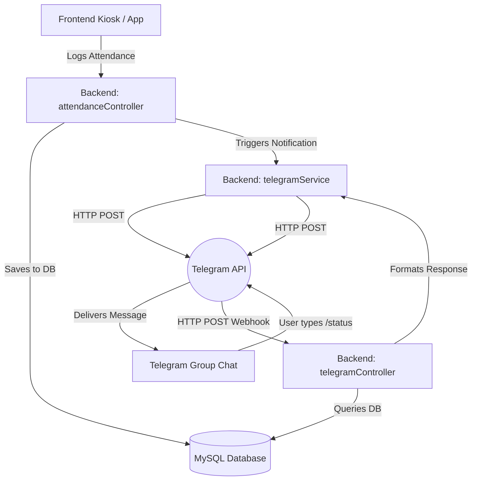
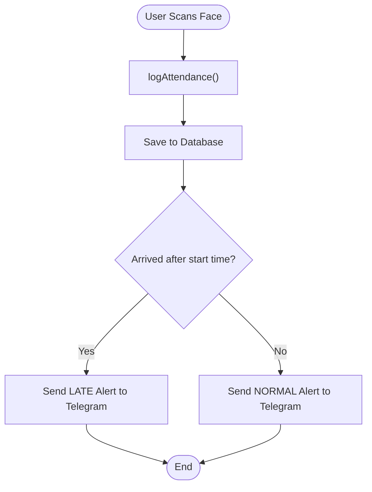
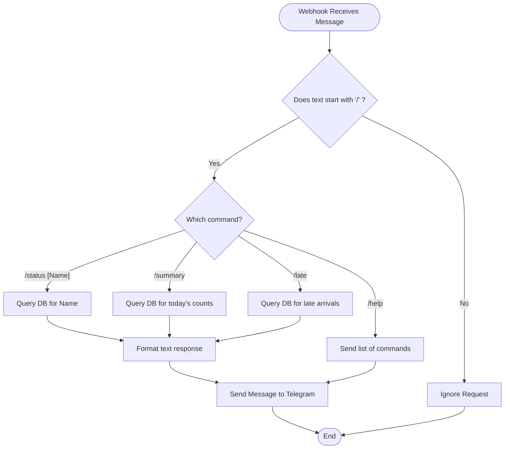

# Facial Recognition Telegram Notifier & Assistant

This document outlines the architecture, structure, and logic required to integrate a Telegram Bot directly into the `jajr_facial_recognition` backend. 

The bot serves two main purposes:
1. **Notifier:** Automatically sends real-time alerts to a specific Telegram group when users check in, check out, or when anomalies (like unrecognized faces/late arrivals) occur.
2. **Assistant:** Allows users in the group to type commands (e.g., `/status`, `/summary`) to query the facial recognition database on the go.

## 1. Technology Stack
- **Messaging Platform:** Telegram (Free API, excellent group chat support).
- **Backend Environment:** Node.js with Express (Your existing backend).
- **Database:** MySQL (Your existing database).

---

## 2. System Architecture

The architecture relies on a two-way flow:
- **Outbound (Notifier):** Your existing `attendanceController.js` uses an HTTP client to push messages to the Telegram API.
- **Inbound (Assistant):** Telegram pushes messages via Webhook to a new `telegramController.js` in your backend, which reads the database and replies.



---

## 3. Recommended Folder Structure Additions

Add the following files to your existing Node.js backend:

```text
backend/
│
├── services/
│   └── telegramService.js    # Logic for communicating with Telegram API
│
├── controllers/
│   └── telegramController.js # Handles incoming webhook requests from Telegram
│
├── routes/
│   └── telegramRoutes.js     # Route definition for /webhook
│
└── .env                      # Add TELEGRAM_BOT_TOKEN & TELEGRAM_ADMIN_CHAT_ID
```

---

## 4. Core Algorithm & Logic Flow

### The Notifier Flow
1. **User Scans Face:** The frontend sends a request to `/api/attendance/log`.
2. **Process:** `attendanceController.js` validates the request and inserts a record into `attendance_logs`.
3. **Notify:** The controller checks the time (to flag if they are late) and calls `telegramService.sendMessage(ADMIN_CHAT_ID, "John Doe clocked IN (Late)").`

### The Assistant Flow
1. **User Asks:** An admin in the Telegram group types `/summary`.
2. **Webhook Triggered:** Telegram sends an HTTP POST to `your-domain.com/api/telegram/webhook`.
3. **Parse Command:** `telegramController.js` receives the payload, extracts the text, and identifies the command `/summary`.
4. **Query:** The controller queries the `attendance_logs` table for today's records.
5. **Respond:** The controller formats the data ("Total Present: 45, Absent: 5") and calls `telegramService.sendMessage()` to reply to the chat.

---

## 5. Flowcharts

### Notifier Flowchart


### Assistant Flowchart


---

## 6. Pseudocode

```javascript
// ==========================================
// services/telegramService.js
// ==========================================
Function sendMessage(chatId, text):
    url = "https://api.telegram.org/bot" + process.env.TELEGRAM_BOT_TOKEN + "/sendMessage"
    payload = { chat_id: chatId, text: text }
    Await HTTP.POST(url, payload)

// ==========================================
// controllers/attendanceController.js (Modifications)
// ==========================================
Function logAttendance(req, res):
    // ... existing validation and DB insert logic ...
    
    // NEW: Send Telegram Notification
    userName = userRows[0].name
    time = current_time
    
    message = "✅ " + userName + " clocked " + status + " at " + time
    telegramService.sendMessage(process.env.TELEGRAM_ADMIN_CHAT_ID, message)
    
    Return HTTP 200 OK

// ==========================================
// controllers/telegramController.js
// ==========================================
Route POST "/webhook":
    message = req.body.message
    chatId = message.chat.id
    text = message.text
    
    If text.startsWith("/summary"):
        // Query database
        results = db.query("SELECT status, COUNT(*) FROM attendance_logs WHERE DATE(timestamp) = CURRENT_DATE GROUP BY status")
        
        replyText = "📊 Today's Summary:\nPresent: " + results.IN + "\nOut: " + results.OUT
        telegramService.sendMessage(chatId, replyText)
        
    Else If text.startsWith("/status"):
        name = extractNameFromText(text)
        result = db.query("SELECT status, timestamp FROM attendance_logs WHERE user_id = (SELECT id FROM users WHERE name = ?) ORDER BY timestamp DESC LIMIT 1", name)
        
        replyText = name + " is currently " + result.status + " (since " + result.timestamp + ")"
        telegramService.sendMessage(chatId, replyText)
        
    Return HTTP 200 OK
```

---

## 7. Comprehensive Development Roadmap

### Phase 1: Foundation & Local Setup
1. **Telegram Setup:** 
   - Open Telegram and search for `@BotFather`.
   - Send `/newbot` and follow the prompts to get your `TELEGRAM_BOT_TOKEN`.
   - Create a Telegram Group, add your new bot to it, and use an API like `https://api.telegram.org/bot<TOKEN>/getUpdates` to find the group's Chat ID.
   - Save both values to your backend `.env` file as `TELEGRAM_BOT_TOKEN` and `TELEGRAM_ADMIN_CHAT_ID`.
2. **Create Service:** 
   - Run `npm install axios` in your backend folder.
   - Create `services/telegramService.js`.
   - Write an asynchronous function `sendMessage(chatId, text)` that makes a POST request to `https://api.telegram.org/bot<TOKEN>/sendMessage`.
3. **Hook up Notifier:** 
   - Open `controllers/attendanceController.js`.
   - Locate the `logAttendance` function where the database insert happens.
   - Add a line to call `telegramService.sendMessage()` to instantly push a formatted string (e.g., "✅ John Doe clocked IN") to the `TELEGRAM_ADMIN_CHAT_ID`.
4. **Expose Localhost:** 
   - Download and install **ngrok**.
   - Run `ngrok http 5000` in your terminal to generate a temporary `https://` URL forwarding to your local server.
   - Make a GET request in your browser to `https://api.telegram.org/bot<TOKEN>/setWebhook?url=https://<your-ngrok-url>/api/telegram/webhook` to tell Telegram where to send messages.
5. **Build Assistant:** 
   - Create `routes/telegramRoutes.js` and `controllers/telegramController.js`.
   - In the controller, parse `req.body.message.text` for commands.
   - Write SQL queries to fetch data based on the command (e.g., `SELECT * FROM attendance_logs WHERE DATE(timestamp) = CURRENT_DATE` for `/summary`).
   - Use `telegramService.sendMessage()` to send the query results back to the `req.body.message.chat.id`.

### Phase 2: Testing & Hardening
6. **Edge Case Handling:** 
   - Implement parameter validation for commands (e.g., if a user types `/status` but forgets the name, return a helper message: *"Please provide a name, e.g., /status John"*).
   - Handle "No Data" gracefully (e.g., if `/late` returns 0 rows, reply *"Everyone arrived on time today!"* instead of crashing).
7. **Security (Role-Based Access):** 
   - Extract `req.body.message.from.id` from the incoming webhook payload.
   - Create a `TELEGRAM_ALLOWED_ADMINS` variable in your `.env` file (a comma-separated list of Telegram User IDs).
   - In your controller, check if the sender's ID is in the allowed list before executing any database queries. If not, return HTTP 200 without sending a message (to prevent spam).
8. **Database Optimization:** 
   - Add SQL Indexes to the `user_id` and `timestamp` columns in your `attendance_logs` table to ensure that `/summary` and `/status` queries remain instantaneous as the database grows over the years.
   - Ensure all user inputs (like names in `/status [Name]`) are properly escaped in your SQL queries to prevent SQL Injection attacks.

### Phase 3: Production Deployment
9. **Hosting Setup:** 
   - Choose a hosting provider (like Render, Railway, DigitalOcean, or AWS EC2).
   - Provision a production database or ensure your server can connect to your existing production MySQL database.
   - Deploy your Node.js backend code to the server.
10. **Environment Variable Configuration:** 
    - Manually add your `TELEGRAM_BOT_TOKEN`, `TELEGRAM_ADMIN_CHAT_ID`, and `TELEGRAM_ALLOWED_ADMINS` to the hosting provider's environment variable dashboard.
11. **Webhook Update:** 
    - Once deployed, your server will have a permanent domain (e.g., `https://api.yourdomain.com`). Telegram strictly requires an SSL certificate (HTTPS) for webhooks, which most hosts provide automatically.
    - Run the `setWebhook` API call one final time using your permanent production URL. 

### Phase 4: Advanced Features (V2)
12. **Photo Attachments:** 
    - Update `telegramService.js` to include a `sendPhoto(chatId, photoUrl, caption)` function.
    - When a user logs in (or an anomaly is detected), grab the image URL generated by the kiosk.
    - Send the image alongside the notification text to visually verify the clock-in.
13. **Automated Daily Reports:** 
    - Install `node-cron` (`npm install node-cron`).
    - Create a scheduled job that runs at 5:00 PM every day.
    - The job will query the database for the day's statistics and automatically push a beautifully formatted Markdown report to the Admin Group Chat.
14. **Interactive Buttons (Inline Keyboards):** 
    - Modify the `sendMessage` payload in `telegramService.js` to include a `reply_markup` object.
    - Add actionable buttons to notifications. For example, if an "Unrecognized Face" alert is sent, include an inline button labeled **[Register User]**. When an admin taps it, it triggers a specialized conversational flow in the chat to add that face to the system.
